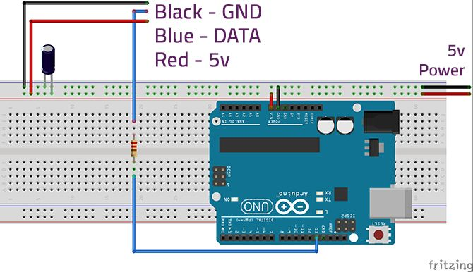
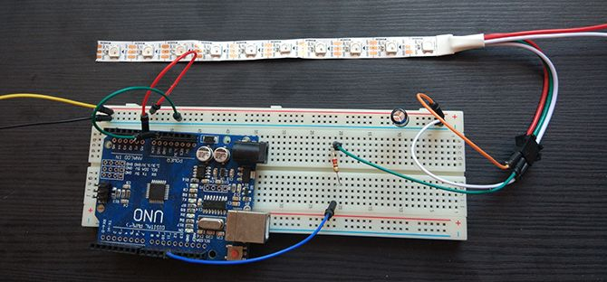

# Currents
Currents changes the colour of your LED lights based on audio playing 
on your device

## Setup
## Overview
Currents drives an arduino connected to your computer via USB based 
on the audio playing from one of your given microphones. The arduino 
in turn controls a set of LED lights which change colour according to 
the audio's frequency. To visualise audio from your computer it's 
expected you create some sort of loopback device (i.e. a virtual audio 
cable) which will be recognised as a microphone.

## Requirements
Your audio device must support:
- 2 Channels
- 441000 Hz Sample Rate
- 32-bit Audio (as specified by [Mini Audio](https://github.com/mackron/miniaudio) - format F32)

## Building Each Component
### Arduino
(credit to [makeuseof](https://www.makeuseof.com/tag/connect-led-light-strips-arduino/))
1. The arduino requires the following parts:
   - WS2811/12/12B 5v LED strip
   - 1 * Arduino Uno 
   - 1 * 220-440 Ohm Resistor (anything between these two values is fine)
   - 1 * 100-1000 microFarad Capacitor (anything between these two values is fine)
   - Breadboard and hook up wires
   - 5V power supply
2. Connect the parts as follows:
   - 
   - 
3. In the arduino file (`./arduino/led/led.ino`) you will need to modify **only** the following definitions (leave the other values as they are):
    - `DATA_PIN` - The data pin you connected the LED to (e.g. 7)
    - `LED_TYPE` - Your LED type (e.g. WS2812B)
    - `NUM_LEDS` - The number of individual LEDs on your strip (e.g. 60)
4. Load the `led.ino` file onto your arduino and run it

### GUI
1. Clone the repo using `git clone https://github.com/fiwippi/currents.git`
2. Build the binary `cd currents && make build`
3. Send the audio you want to visualise to a virtual audio cable (so it can act as a mic)
4. Select this virtual audio cable when running Currents
   
### Running Them Together
If an arduino is connected to your computer, when you run the binary 
you should be able to select it in the "Arduino" tab and begin controlling
the LED lights. 

*Remember you have to start the the visualisation from the "Visualisation" 
tab and also start controlling the arduino from the "Arduino" tab otherwise
the LED lights won't change colour.*

## License
`BSD-3-Clause`